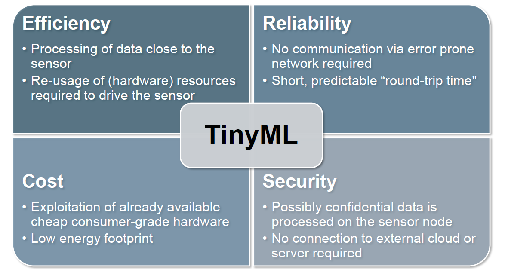

Hi! I am Mark,
===

a scientific researcher working at [Friedrich-Alexander-Universität of Erlangen-Nürnberg (FAU)](https://www.fau.eu/) in the department of [Hardware-Software-Co-Design](https://www.cs12.tf.fau.eu/). I am also affiliated with the [Fraunhofer Institute for Integrated Circuits IIS](https://www.iis.fraunhofer.de/) in Nürnberg where I am a researcher in the [group "Effient-AI"](https://www.iis.fraunhofer.de/de/ff/lv/dataanalytics/tinyml.html).

My work focuses on the efficient design of deep neural networks (DNNs) for use on embedded "edge" systems, mainly Cortex-M microcontroller units (MCUs). This research area is also referred to as "TinyML" or "Edge AI". Since MCUs are generally resource-constrained, while most DNNs are quite resource-intensive, my main research interest is to optimize the trade-off between a DNN's resource requirements and the AI performance it can achieve. As a result, I have focused heavily on hardware-aware neural architecture search, DNN compression, quantization techniques, and MCU-specific optimizations. Recently, I have also added on-device training of fully quantized DNNs on MCUs to the mix.

TinyML and Edge AI
===

Artificial intelligence and self-learning edge systems are becoming increasingly important in business, both for process automation and for analyzing large amounts of data. Until now, a common approach has been to connect these intelligent edge systems to a cloud where AI inference is offloaded, since most AI models, and especially DNNs, require a lot of computing power that is not available at the edge.

TinyML is an area of research that seeks to move AI inference and training to the edge by making AI models more efficient. The benefits are many: First, processing data closer to sensors and on smaller, more energy-efficient microcontrollers significantly reduces power consumption. This makes AI both cheaper and greener. Second, inferring data at the edge reduces round-trip times from data acquisition to prediction by eliminating the need to communicate to a server over a potentially error-prone network. Third, edge AI enhances security, as recorded data that may be sensitive, such as the likeness or voice of people, is processed locally on the sensor node and never stored on an external cloud or server.

To enable AI inference at the edge, TinyML research focuses on efficient DNN design, training, and compression. This amounts to a multi-objective optimization problem. AI performance, e.g., classification accuracy, should be maximized, while computational complexity and memory requirements should be minimized to meet the resource constraints of the targeted edge system. Techniques to achieve this trade-off include DNN pruning, quantization, layer fusion, and hardware-aware neural architecture search.

For more information, check out my [talks](./talks.html) and [publications](./publications.html). If you want to have a look at Edge AI at work, you can have a look at my [demo videos](./portfolio.html).

My background and history
===

I received both my M.Sc. and B.Sc. in Computer Science from the Friedrich-Alexander-Universität of Erlangen-Nürnberg. During my studies I worked for almost five years as a working student at Siemens Mindsphere and then as a student assistant at Fraunhofer IIS first in the group *Self-Learning Systems* and later in the group *Machine Learning & Validation*. I also wrote my master thesis with Fraunhofer IIS on *Energy Efficient Deployment of Deep Learning Applications on Restricted Hardware using Deep Compression*. After graduating, I joined the department of Hardware-Software-Co-Design at FAU as a research assistant and Ph.D. student, while still being associated with Fraunhofer IIS as a member of the *Efficient AI* group. If you want to learn more about me, have a look at my detailed [CV](./cv.md).  