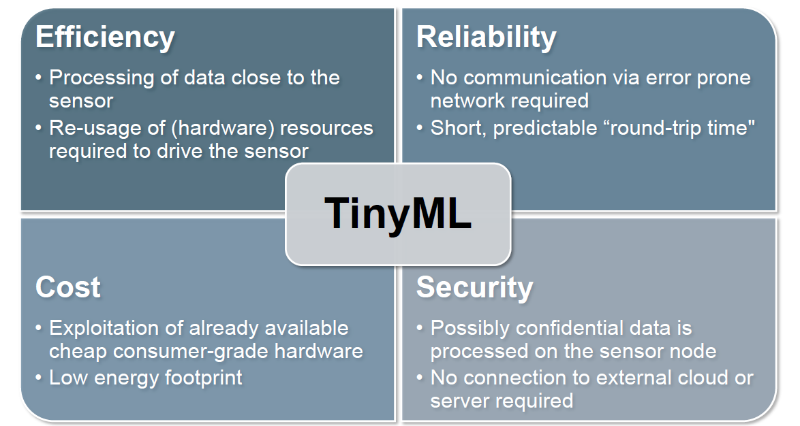

Hi! I am Mark,
===

a scientific researcher working at [Friedrich-Alexander-Universität of Erlangen-Nürnberg (FAU)](https://www.fau.eu/) at the chair of [Hardware-Software-Co-Design](https://www.cs12.tf.fau.eu/). I am also affiliated with the [Fraunhofer Institute for Integrated Circuits IIS](https://www.iis.fraunhofer.de/) in Nürnberg where I am a researcher in the [group "Effient-AI"](https://www.iis.fraunhofer.de/de/ff/lv/dataanalytics/tinyml.html).

My work focuses on the efficient design of deep neural networks (DNNs) for use on embedded edge devices, mainly Cortex-M microcontrollers (MCUs). This research area is also referred to as "Efficient AI" or "Edge AI". Since MCUs are generally resource-constrained, while most DNNs are extremely resource-intensive, my main research interest is to optimize the trade-off between resource requirements of DNNs and the accuracies they can achieve to enable their deployment on embedded systems. I focus heavily on hardware-aware neural architecture search (NAS), DNN compression, quantization techniques, and MCU-specific optimization. Recently, I have also added on-device training of fully quantized DNNs to the mix.

Efficient AI
===

Artificial intelligence and self-learning edge devices are becoming increasingly important, both for process automation and for analyzing large amounts of data. Until now, a common approach has been to connect "intelligent" edge systems to the cloud, where AI inference is offloaded, as most AI models, and especially DNNs, require a lot of computing power that is not available at the edge.

Efficient AI is an area of research that seeks to move AI inference and training to the edge by making AI models more efficient. There are many benefits to this approach: First, processing data closer to sensors and on smaller, more energy-efficient MCUs significantly reduces power consumption. This makes AI execution both cheaper and greener. Second, inferring data at the edge reduces round-trip times from data acquisition to prediction by eliminating the need to communicate to a server over a potentially error-prone network. Third, edge AI enhances security, as recorded data that may be sensitive is processed locally on the sensor node and never sent to and stored on an external server.

To enable AI inference at the edge, efficient AI research focuses on efficient DNN design, training, and compression. This amounts to a multi-objective optimization problem. AI performance, e.g., classification accuracy, should be maximized, while computational complexity and memory requirements should be minimized to meet the resource constraints of the targeted edge device. Techniques to achieve this trade-off include DNN pruning, quantization, layer fusion, and hardware-aware neural architecture search.

For more information, check out my [talks](./talks.html) and [publications](./publications.html). If you want to have a look at Edge AI at work, you can have a look at my [demo videos](./portfolio.html).

My background and history
===

I received both my M.Sc. and B.Sc. in computer science from the Friedrich-Alexander-Universität of Erlangen-Nürnberg. During my studies, I worked for almost five years as a working student at Siemens Mindsphere and then as a student assistant at Fraunhofer IIS, first in the group *Self-Learning Systems* and later in the group *Machine Learning & Validation*. I also wrote my master’s thesis with Fraunhofer IIS on *Energy Efficient Deployment of Deep Learning Applications on Restricted Hardware using Deep Compression*. After graduating, I joined the chair of Hardware-Software-Co-Design at FAU as a research assistant and Ph.D. student, while still being associated with Fraunhofer IIS as a member of the *Efficient AI* group. If you want to learn more about me, have a look at my detailed [CV](./cv.md).  